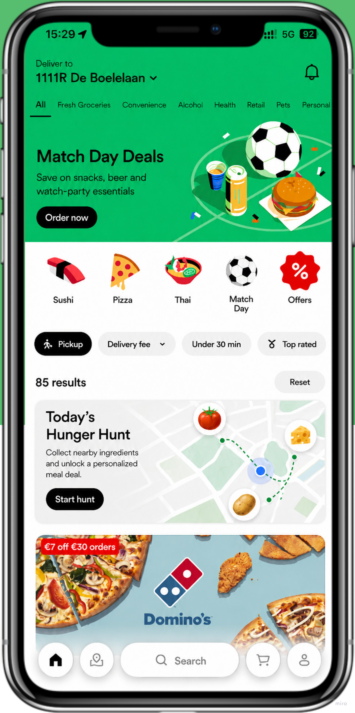
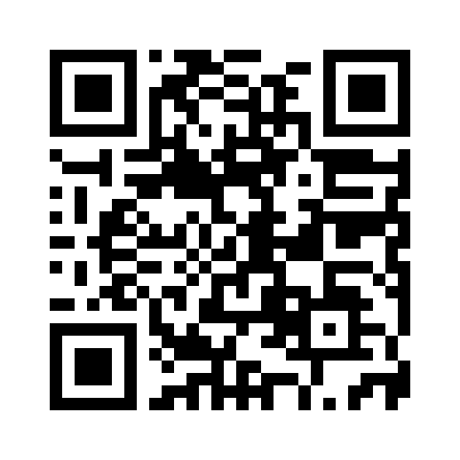
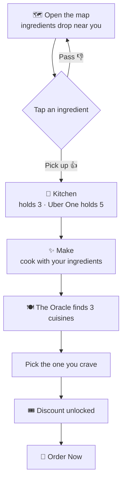
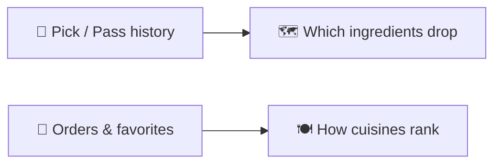

<h1 align="center">Uber Eats Oracle 🔮</h1>

<b>Can't decide what to eat?</b> Hunt ingredients near you → cook a dish → unlock a personalized discount.

  

---

## 📲 Try it on your phone

  <a href="https://sijiezeng.github.io/TigerBalm/"><b>https://sijiezeng.github.io/TigerBalm/</b></a>

  

In WeChat/QQ, tap ··· → <b>Open in browser</b> for the best experience.

---

## 🎮 How it works

## 💸 Reward = how many ingredients you commit

| Ingredients used | Reward |
| :--: | :-- |
| **1** | 50% off the dish |
| **3** | The dish is **free** |
| **5** | 20% off your whole order |

Only 1 ingredient enters your bag per day → bigger rewards = a multi-day (and member-gated) investment. Sustainable for restaurants.

## 🧠 Personalization — the game *is* the data

Two fully decoupled signals: what you collect shapes the map; what you order shapes the menu.

## 🛠️ Built with

React · Vite · Tailwind CSS · Framer Motion · 100% mock data (no backend)

## 👩‍💻 Contributors

* **iamwangshuang** - Co-developer
